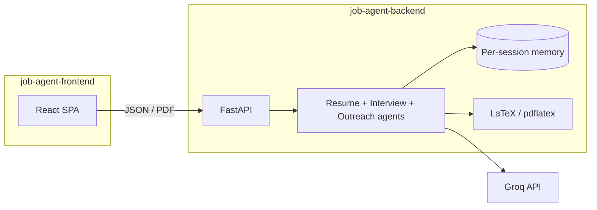

# Agentic Interview Helper

**Agentic Interview Helper** is an **agentic AI** interview copilot: specialized **LLM agents** on the backend (resume, interview, outreach) plus a **goal-oriented UI** on the frontend—plans, progress, and session-aware flows—so the product behaves like an assistant working *with* you, not a single static prompt.

Full-stack **MVP** for interview prep: **tailor a resume to a job** (PDF via LLM + LaTeX), run an **adaptive behavioral/technical interview** (Groq-backed Q&A with scores and follow-ups), and **professional outreach** drafts via `**POST /frame-message`** (Groq), with a **local template fallback** in the UI if the request fails.


| Layer        | Stack                                                                        |
| ------------ | ---------------------------------------------------------------------------- |
| **Frontend** | React 19, Vite 8 (`job-agent-frontend/`)                                     |
| **Backend**  | FastAPI, Uvicorn (`job-agent-backend/`)                                      |
| **LLM**      | Groq API (`llama-3.3-70b-versatile` — see `job-agent-backend/app/config.py`) |
| **PDF**      | LaTeX → `pdflatex` on the server                                             |


**Documentation:** this file provides the overview for the repo. We also have in depth copied in the sub folders in `[job-agent-backend/README.md](job-agent-backend/README.md)` and `[job-agent-frontend/README.md](job-agent-frontend/README.md)`.

---

## Table of contents

- [Features](#features)
- [What makes this agentic AI?](#what-makes-this-agentic-ai)
- [Architecture](#architecture)
- [Repository layout](#repository-layout)
- [Prerequisites](#prerequisites)
- [Environment variables](#environment-variables)
- [Quick start](#quick-start)
- [HTTP API (backend)](#http-api-backend)
- [Frontend](#frontend)
- [Persistence & storage](#persistence--storage)
- [Production notes](#production-notes)
- [Troubleshooting](#troubleshooting)
- [Roadmap](#roadmap)
- [Contributing & license](#contributing--license)

---

## Features


| Area                      | What it does                                                             | Where it runs                                           |
| ------------------------- | ------------------------------------------------------------------------ | ------------------------------------------------------- |
| **Welcome**               | Collects display name; optional `localStorage`                           | Frontend only                                           |
| **Tailor resume**         | Paste resume + JD → download tailored **PDF**                            | `POST /tailor-resume`                                   |
| **Interview simulator**   | Adaptive Q&A with explicit follow-up/next branching, optional panel/pressure modes, and end-of-session evaluation flow | `POST /start-interview`, `POST /submit-answer`, `POST /advance-interview`          |
| **Professional outreach** | Purpose, channel, tone, context → LLM draft + copy                       | `POST /frame-message` (fallback: browser templates)     |
| **Agent-style dashboard** | Progress, insights, goals, weak-area memory, plan timelines (agentic UX) | Mostly **frontend**; interview scores/feedback from API |


---

## What makes this agentic AI?

**Agentic** here means the system is built around **autonomous-style helpers** (LLM-backed **agents**) that take structured goals, use **memory** or **tools**, and produce the next artifact—not one-off completions with no state.


| Behavior                    | How this repo implements it                                                                                                                                                      |
| --------------------------- | -------------------------------------------------------------------------------------------------------------------------------------------------------------------------------- |
| **Specialized agents**      | Separate agent modules for **resume tailoring**, **interview Q&A** (generate + evaluate), and **outreach framing** (`app/agents/`).                                              |
| **Stateful interview loop** | Each `session_id` keeps **conversation memory**; new questions and feedback depend on prior answers and scores (`storage/` + `memory.py`).                                       |
| **Adaptive coaching**       | Difficulty and follow-up style adapt to recent answers, weak topics, optional panel personas, and optional pressure simulation.                                                    |
| **Tool-style outcomes**     | Resume path: LLM → structured content → **LaTeX / `pdflatex`** → PDF download.                                                                                                   |
| **Goal-oriented UI**        | Welcome flow, tabs, **workflow progress**, **plan timelines**, goals/subtasks, and heuristics that mirror “what the agent is doing next” (see `job-agent-frontend/src/App.jsx`). |
| **Grounded outreach**       | `/frame-message` returns **message + confidence + rationale** so the user sees a trace of *why* the draft fits (when the API succeeds).                                          |


This is still an **MVP**: agents are orchestrated in code (not a general-purpose autonomous agent framework), but the pattern is intentionally **agentic**—plan, act, observe, repeat—especially in the interview and resume flows.

---

## Architecture

The diagram shows how the **agentic backend** (multiple LLM-driven flows + memory + PDF tooling) connects to the **copilot UI**.




---

## Repository layout

```text
agentic-interview-helper/     # project root (your clone folder name may differ)
├── README.md                 ← this file (repo home on GitHub/GitLab)
├── job-agent-backend/        # FastAPI + Groq + PDF pipeline
│   ├── app/
│   │   ├── main.py           # App, CORS, routers
│   │   ├── config.py       # GROQ_* , paths (fails fast if GROQ_API_KEY missing)
│   │   ├── schemas.py      # Request/response models
│   │   ├── routes/         # resume, interview, outreach
│   │   ├── agents/         # resume_agent, interview_agent, outreach_agent
│   │   └── utils/          # llm, latex, memory
│   ├── storage/            # memory + PDF outputs (runtime)
│   ├── requirements.txt
│   └── README.md
└── job-agent-frontend/       # React + Vite SPA
    ├── src/                  # App.jsx, styles
    ├── package.json
    ├── .env.example          # VITE_API_BASE_URL
    └── README.md
```

---

## Prerequisites

- **Python 3.10+** (virtualenv or Conda is fine)
- **Node.js 18+**
- A **Groq** account and API key
- `**pdflatex`** installed and on your `**PATH**` (required for resume PDFs)

---

## Environment variables


| Variable            | Required by             | Purpose                                                                                                                                                                             |
| ------------------- | ----------------------- | ----------------------------------------------------------------------------------------------------------------------------------------------------------------------------------- |
| `GROQ_API_KEY`      | **Backend**             | Loaded at import in `app/config.py`; the app will **not start** without it.                                                                                                         |
| `VITE_API_BASE_URL` | **Frontend** (optional) | Base URL for `fetch`. Default in code: `http://127.0.0.1:8000`. Copy `[job-agent-frontend/.env.example](job-agent-frontend/.env.example)` to `job-agent-frontend/.env` to override. |


---

## Quick start

Use **two terminals**. On Windows, **PowerShell** examples below; on macOS/Linux, use `source .venv/bin/activate` instead of `.\.venv\Scripts\Activate.ps1`.

### 1) Backend API

```powershell
cd job-agent-backend
python -m venv .venv
.\.venv\Scripts\Activate.ps1
pip install -r requirements.txt
$env:GROQ_API_KEY="your_groq_api_key_here"
uvicorn app.main:app --reload --host 127.0.0.1 --port 8000
```

**Important:** run Uvicorn with `**job-agent-backend` as the current working directory**. If you run it from the repo root, Python will raise `ModuleNotFoundError: No module named 'app'`.


| URL                                                          | Description           |
| ------------------------------------------------------------ | --------------------- |
| [http://127.0.0.1:8000](http://127.0.0.1:8000)               | `GET /` — JSON status |
| [http://127.0.0.1:8000/health](http://127.0.0.1:8000/health) | Health JSON           |
| [http://127.0.0.1:8000/docs](http://127.0.0.1:8000/docs)     | Swagger UI            |


### 2) Frontend

```powershell
cd job-agent-frontend
npm install
npm run dev
```

Open the URL Vite prints (commonly **[http://localhost:5173](http://localhost:5173)**).

---

## HTTP API (backend)

Base URL (local): `http://127.0.0.1:8000`. Errors are typically JSON: `{ "error": "message" }`.

### `POST /tailor-resume`


|                |                                                              |
| -------------- | ------------------------------------------------------------ |
| **Body**       | JSON: `{ "resume_text": string, "job_description": string }` |
| **Success**    | **Binary PDF** (`application/pdf`), not a JSON path          |
| **Client tip** | Use `fetch` → `response.blob()` → object URL + download      |


### `POST /start-interview`


|             |                                                                                                                   |
| ----------- | ----------------------------------------------------------------------------------------------------------------- |
| **Body**    | JSON: `{ "mode": "behavioral" | "technical", "session_id": string, "job_description": string, "resume": string, "panel_mode"?: bool, "pressure_round"?: bool, "company_context"?: string, "role_context"?: string, "interview_date"?: "YYYY-MM-DD" }` |
| **Success** | JSON: `{ "question": string, "interview_started": true, "target_question_count": number }`                      |
| **Notes**   | Resets server-side memory for that `session_id` and generates the first question.                                 |


**Example request:**

```json
{
  "mode": "behavioral",
  "session_id": "user_123_session_1",
  "job_description": "Hiring backend engineer with FastAPI and PostgreSQL.",
  "resume": "Backend engineer with 3 years experience building APIs..."
}
```

### `POST /submit-answer`


|             |                                                                          |
| ----------- | ------------------------------------------------------------------------ |
| **Body**    | JSON: `{ "session_id": string, "answer": string }`                       |
| **Success** | JSON always includes score/feedback/critique/rewrite and decision metadata. During interview it returns `waiting_for_next_step=true` plus both `follow_up_question` and `next_question`. On completion it returns `interview_complete=true` plus final outputs (`final_evaluation`, `debrief_actions`, `next_round_target`, `curriculum_plan`). |
| **Notes**   | Call `/start-interview` first, then `/submit-answer`, then `/advance-interview` if `waiting_for_next_step=true`. |


**Example request:**

```json
{
  "session_id": "user_123_session_1",
  "answer": "I used a structured communication plan and weekly demos..."
}
```

### `POST /advance-interview`


|             |                                                                                                    |
| ----------- | -------------------------------------------------------------------------------------------------- |
| **Body**    | JSON: `{ "session_id": string, "choice": "follow_up" | "next_question" }`                         |
| **Success** | JSON: `{ "question": string }`                                                                     |
| **Notes**   | Required only when `/submit-answer` returns `waiting_for_next_step=true`; commits selected branch. |


### `POST /frame-message`


|                |                                                                                                                                                                          |
| -------------- | ------------------------------------------------------------------------------------------------------------------------------------------------------------------------ |
| **Body**       | JSON: `message_type`, `channel`, `tone`, optional `sender_name`, `recipient_name`, `company`, `role`, `notes` (see Swagger for field names)                              |
| **Success**    | JSON: `{ "message": string, "confidence": "high" | "medium" | "low", "rationale": string }`                                                                              |
| **Validation** | At least one of `role`, `company`, `recipient_name`, or `notes` must be non-empty.                                                                                       |
| **Notes**      | Uses Groq. `message_type`: `follow_up` | `thank_you` | `cold` | `connection` | `schedule`. `channel`: `email` | `linkedin`. `tone`: `professional` | `warm` | `concise`. |


**Example request:**

```json
{
  "message_type": "schedule",
  "channel": "email",
  "tone": "professional",
  "sender_name": "Alex Rivera",
  "recipient_name": "Jordan",
  "company": "Northwind Labs",
  "role": "Software engineering intern",
  "notes": "Referred by Sam; portfolio at example.com"
}
```

---

## Frontend


| Script           | Command           |
| ---------------- | ----------------- |
| Dev server       | `npm run dev`     |
| Production build | `npm run build`   |
| Preview build    | `npm run preview` |
| Lint             | `npm run lint`    |


The app defaults the API to `**http://127.0.0.1:8000**`. To point elsewhere, set `VITE_API_BASE_URL` in `job-agent-frontend/.env`.

---

## Persistence & storage

- **Interview:** state is kept per `**session_id`** under `job-agent-backend/storage/` (see `app/utils/memory.py`).
- **Resume PDFs:** written under `job-agent-backend/storage/outputs/` during tailoring.
- **Browser:** name and weak-area hints may be stored in `**localStorage`** (frontend only).

Add `storage/` patterns to `.gitignore` if you do not want runtime artifacts committed (evaluate per your team’s preference).

---

## Production notes

- **CORS:** `job-agent-backend/app/main.py` uses `allow_origins=["*"]` for local dev. For production, **restrict** `allow_origins` to your real frontend origin(s).
- **Secrets:** never commit `GROQ_API_KEY`; use your host’s secret manager or env injection.
- **HTTPS:** terminate TLS at your reverse proxy or platform; serve the SPA over HTTPS when possible.

---

## Troubleshooting


| Problem                                      | Likely fix                                                                 |
| -------------------------------------------- | -------------------------------------------------------------------------- |
| `ModuleNotFoundError: No module named 'app'` | `cd job-agent-backend` before `uvicorn app.main:app ...`                   |
| Backend crashes on import                    | Set `GROQ_API_KEY` before starting (required by `config.py`).              |
| Resume PDF fails                             | Ensure `pdflatex` is installed and on `PATH`.                              |
| Frontend cannot reach API                    | Confirm backend is up; set `VITE_API_BASE_URL` if not on `127.0.0.1:8000`. |
| CORS in production                           | Replace `allow_origins=["*"]` with your frontend URL.                      |


---

## Roadmap

- Stricter **CORS** and optional **auth** for multi-tenant deployments.
- Optional **ignore rules** for generated `storage/` files in git.

---

## Subfolder READMEs

- [Backend — setup, PDF vs JSON, CORS, notes](job-agent-backend/README.md)
- [Frontend — scripts, `.env`, feature list](job-agent-frontend/README.md)

