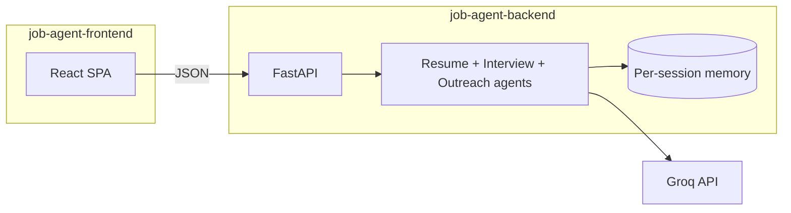

# Agentic Interview Helper

**Agentic Interview Helper** is an **agentic AI** interview copilot: specialized **LLM agents** on the backend (resume, interview, outreach) plus a **goal-oriented UI** on the frontend—plans, progress, and session-aware flows—so the product behaves like an assistant working *with* you, not a single static prompt.

Full-stack **MVP** for interview prep: **tailor a resume to a job** (structured bullets the user can copy/paste), run an **adaptive behavioral/technical interview** (Groq-backed Q&A with session memory, panel simulation, and follow-ups), and create **professional outreach** drafts via `POST /frame-message` (Groq), with a **local template fallback** in the UI if the request fails.


| Layer        | Stack                                                                        |
| ------------ | ---------------------------------------------------------------------------- |
| **Frontend** | React 19, Vite 8 (`job-agent-frontend/`)                                     |
| **Backend**  | FastAPI, Uvicorn (`job-agent-backend/`)                                      |
| **LLM**      | Groq API (`llama-3.3-70b-versatile` — see `job-agent-backend/app/config.py`) |


**Documentation:** this file provides the overview for the repo. We also have in depth copied in the sub folders in `[job-agent-backend/README.md](job-agent-backend/README.md)` and `[job-agent-frontend/README.md](job-agent-frontend/README.md)`.

---

## Table of contents

- [Features](#features)
- [What makes this agentic AI?](#what-makes-this-agentic-ai)
- [Architecture](#architecture)
- [Repository layout](#repository-layout)
- [Prerequisites](#prerequisites)
- [Environment variables](#environment-variables)
- [Quick start](#quick-start)
- [HTTP API (backend)](#http-api-backend)
- [Frontend](#frontend)
- [Persistence & storage](#persistence--storage)
- [Evaluation workflow](#evaluation-workflow)
- [Code source declaration](#code-source-declaration)
- [Roadmap](#roadmap)
- [Contributing & license](#contributing--license)

---

## Features


| Area                      | What it does                                                             | Where it runs                                           |
| ------------------------- | ------------------------------------------------------------------------ | ------------------------------------------------------- |
| **Welcome**               | Collects display name; optional `localStorage`                           | Frontend only                                           |
| **Tailor resume**         | Paste resume + JD → tailored summary/experience/skills output to copy/paste | `POST /tailor-resume` |
| **Interview simulator**   | Adaptive Q&A with follow-up/next branching, optional panel/pressure modes, session resume/pause, end-of-session evaluation | `POST /start-interview`, `POST /submit-answer`, `POST /advance-interview` |
| **Interview sessions API** | List/get/delete interview sessions for resume/restore flows                | `GET /interview-sessions`, `GET /interview-sessions/{session_id}`, `DELETE /interview-sessions/{session_id}` |
| **Professional outreach** | Purpose/channel/tone/context → LLM draft + copy. UI supports predefined or custom purpose (`Other`) | `POST /frame-message` (fallback: browser templates) |
| **Agent-style dashboard** | Compact progress/insights strip, details on demand, live status hints      | Mostly **frontend**; interview/orchestration metadata from API |


---

## What makes this agentic AI?

**Agentic** here means the system is built around **autonomous-style helpers** (LLM-backed **agents**) that take structured goals, use **memory** or **tools**, and produce the next artifact—not one-off completions with no state.


| Behavior                    | How this repo implements it                                                                                                                                                      |
| --------------------------- | -------------------------------------------------------------------------------------------------------------------------------------------------------------------------------- |
| **Specialized agents**      | Separate agent modules for **resume tailoring**, **interview Q&A** (generate + evaluate), and **outreach framing** (`app/agents/`).                                              |
| **Stateful interview loop** | Each `session_id` keeps **conversation memory**; new questions and feedback depend on prior answers and scores (`storage/` + `memory.py`).                                       |
| **Adaptive coaching**       | Difficulty and follow-up style adapt to recent answers, weak topics, optional panel personas, and optional pressure simulation.                                                    |
| **Tool-style outcomes**     | Resume path: LLM returns structured, copy-ready tailoring output; interview path returns critique/rewrite/follow-ups and completion plans.                                         |
| **Goal-oriented UI**        | Welcome flow, tabs, compact workflow status, panel simulation mode, resume/continue prompts, interview transcript view, and heuristics that mirror “what the agent is doing next”. |
| **Grounded outreach**       | `/frame-message` returns **message + confidence + rationale** so the user sees a trace of *why* the draft fits (when the API succeeds).                                          |


This is still an **MVP**: agents are orchestrated in code (not a general-purpose autonomous agent framework), but the pattern is intentionally **agentic**—plan, act, observe, repeat—especially in the interview and resume flows.

---

## Architecture

The diagram shows how the **agentic backend** (multiple LLM-driven flows + session memory) connects to the **copilot UI**.




---

## Repository layout

```text
agentic-interview-helper/     # project root (your clone folder name may differ)
├── README.md                 # repo overview, setup, API summary
├── .gitignore                # git ignore patterns for repo-wide artifacts
├── evaluation/               # 4-criteria evaluation toolkit + summary scripts
│   ├── correctness-benchmark/
│   ├── clarity-structure-review/
│   ├── depth-analysis/
│   ├── relevance-alignment/
│   ├── bootstrap_from_raw.py # seeds templates from backend raw artifacts
│   └── run_evaluation.py     # computes summary CSV/Markdown evidence
├── job-agent-backend/        # FastAPI backend: resume/interview/outreach APIs
│   ├── app/
│   │   ├── __init__.py       # package marker
│   │   ├── main.py           # FastAPI app, CORS config, router registration
│   │   ├── config.py         # environment + model/path configuration
│   │   ├── schemas.py        # Pydantic request/response models
│   │   ├── routes/
│   │   │   ├── resume_routes.py      # /tailor-resume endpoint
│   │   │   ├── interview_routes.py   # /start-interview, /submit-answer, /advance-interview, session APIs
│   │   │   └── outreach_routes.py    # /frame-message endpoint
│   │   ├── agents/
│   │   │   ├── resume_agent.py       # resume tailoring logic
│   │   │   ├── interview_agent.py    # interview question/evaluation logic
│   │   │   └── outreach_agent.py     # outreach draft generation logic
│   │   └── utils/
│   │       ├── llm.py                # Groq LLM call helpers
│   │       ├── memory.py             # per-session memory file persistence
│   │       └── latex.py              # legacy latex helper utilities
│   ├── storage/               # runtime artifacts
│   │   ├── raw-evaluation-data/ # exported dataset/results snapshots
│   │   ├── memory_*.json      # per-session interview memory snapshots
│   │   └── outputs/           # optional/legacy generated output files
│   ├── requirements.txt       # Python dependencies
│   └── README.md              # backend-specific setup and API details
└── job-agent-frontend/        # React + Vite single-page app
    ├── src/
    │   ├── App.jsx            # main UI + interview/outreach/resume flows
    │   ├── App.css            # app-level styles
    │   ├── index.css          # global styles
    │   ├── main.jsx           # React entrypoint
    │   └── assets/            # static app assets used by UI
    ├── public/
    │   ├── favicon.svg        # browser tab icon
    │   └── icons.svg          # static icon sprite/assets
    ├── package.json           # npm scripts and frontend dependencies
    ├── package-lock.json      # dependency lockfile
    ├── vite.config.js         # Vite configuration
    ├── .env.example           # example frontend env vars (VITE_API_BASE_URL)
    └── README.md              # frontend-specific setup and usage
```

---

## Prerequisites

To run this project locally, evaluators need:

- **Python 3.10+** (virtualenv or Conda is fine) for the backend
- **Node.js 18+** and **npm** for the frontend
- A **Groq account** and a **Groq API key** (you must generate your own key; it is not included in this repo)
- Internet access for Groq API calls during resume/interview/outreach generation
- Two terminal windows (one for backend, one for frontend)

Not required: Docker, database setup, or additional cloud services.

---

## Environment variables


| Variable            | Required by             | Purpose                                                                                                                                                                             |
| ------------------- | ----------------------- | ----------------------------------------------------------------------------------------------------------------------------------------------------------------------------------- |
| `GROQ_API_KEY`      | **Backend**             | Loaded at import in `app/config.py`; the app will **not start** without it.                                                                                                         |
| `VITE_API_BASE_URL` | **Frontend** (optional) | Base URL for `fetch`. Default in code: `http://127.0.0.1:8000`. Copy `[job-agent-frontend/.env.example](job-agent-frontend/.env.example)` to `job-agent-frontend/.env` to override. |


---

## Quick start

Use **two terminals** (Terminal A for backend, Terminal B for frontend).

### 1) Create your Groq API key (required before backend start)

1. Go to [https://console.groq.com/](https://console.groq.com/) and sign in.
2. Open **API Keys**.
3. Click **Create API Key**.
4. Copy the key value immediately (Groq may only show it once).
5. Set the variable in your backend terminal:

**Windows (PowerShell)**

```powershell
$env:GROQ_API_KEY="paste_your_real_groq_key_here"
```

**macOS/Linux (bash/zsh)**

```bash
export GROQ_API_KEY="paste_your_real_groq_key_here"
```

6. Verify it is set in the same terminal:

**Windows (PowerShell)**

```powershell
echo $env:GROQ_API_KEY
```

**macOS/Linux (bash/zsh)**

```bash
echo $GROQ_API_KEY
```

If this prints nothing, the backend will not start.

### 2) Backend API

**Windows (PowerShell)**

```powershell
cd job-agent-backend
python -m venv .venv
.\.venv\Scripts\Activate.ps1
pip install -r requirements.txt
uvicorn app.main:app --reload --host 127.0.0.1 --port 8000
```

**macOS/Linux (bash/zsh)**

```bash
cd job-agent-backend
python3 -m venv .venv
source .venv/bin/activate
pip install -r requirements.txt
uvicorn app.main:app --reload --host 127.0.0.1 --port 8000
```

**Important:** run Uvicorn with `**job-agent-backend` as the current working directory**. If you run it from the repo root, Python will raise `ModuleNotFoundError: No module named 'app'`.


| URL                                                          | Description           |
| ------------------------------------------------------------ | --------------------- |
| [http://127.0.0.1:8000](http://127.0.0.1:8000)               | `GET /` — JSON status |
| [http://127.0.0.1:8000/health](http://127.0.0.1:8000/health) | Health JSON           |
| [http://127.0.0.1:8000/docs](http://127.0.0.1:8000/docs)     | Swagger UI            |


### 3) Frontend

**Windows (PowerShell)**

```powershell
cd job-agent-frontend
npm install
npm run dev
```

**macOS/Linux (bash/zsh)**

```bash
cd job-agent-frontend
npm install
npm run dev
```

Open the URL Vite prints (commonly **[http://localhost:5173](http://localhost:5173)**).

---

## HTTP API (backend)

Base URL (local): `http://127.0.0.1:8000`. Errors are typically JSON: `{ "error": "message" }`.

### `POST /tailor-resume`


|                |                                                              |
| -------------- | ------------------------------------------------------------ |
| **Body**       | JSON: `{ "resume_text": string, "job_description": string }` |
| **Success**    | JSON with structured tailored output (summary, experience bullet suggestions, skills) |
| **Client tip** | Render output in the UI and let users copy/paste into their resume editor |


### `POST /start-interview`


|             |                                                                                                                   |
| ----------- | ----------------------------------------------------------------------------------------------------------------- |
| **Body**    | JSON: `{ "mode": "behavioral" | "technical", "session_id": string, "job_description": string, "resume": string, "panel_mode"?: bool, "pressure_round"?: bool, "company_context"?: string, "role_context"?: string, "interview_date"?: "YYYY-MM-DD" }` |
| **Success** | JSON: `{ "question": string, "persona": string, "interview_started": true, "target_question_count": number }`                      |
| **Notes**   | Resets server-side memory for that `session_id` and generates the first question.                                 |


**Example request:**

```json
{
  "mode": "behavioral",
  "session_id": "user_123_session_1",
  "job_description": "Hiring backend engineer with FastAPI and PostgreSQL.",
  "resume": "Backend engineer with 3 years experience building APIs..."
}
```

### `POST /submit-answer`


|             |                                                                          |
| ----------- | ------------------------------------------------------------------------ |
| **Body**    | JSON: `{ "session_id": string, "answer": string }`                       |
| **Success** | JSON always includes score/feedback/critique/rewrite and decision metadata. During interview it returns `waiting_for_next_step=true` plus both `follow_up_question` and `next_question`. On completion it returns `interview_complete=true` plus final outputs (`final_evaluation`, `debrief_actions`, `next_round_target`, `curriculum_plan`). |
| **Notes**   | Call `/start-interview` first, then `/submit-answer`, then `/advance-interview` if `waiting_for_next_step=true`. |


**Example request:**

```json
{
  "session_id": "user_123_session_1",
  "answer": "I used a structured communication plan and weekly demos..."
}
```

### `POST /advance-interview`


|             |                                                                                                    |
| ----------- | -------------------------------------------------------------------------------------------------- |
| **Body**    | JSON: `{ "session_id": string, "choice": "follow_up" | "next_question" }`                         |
| **Success** | JSON: `{ "question": string, "persona": string }`                                                                     |
| **Notes**   | Required only when `/submit-answer` returns `waiting_for_next_step=true`; commits selected branch. |


### Interview session lifecycle

| Endpoint | Purpose |
| --- | --- |
| `GET /interview-sessions?limit=30` | List recent sessions (mode, completion, counts, updated time). |
| `GET /interview-sessions/{session_id}` | Load full persisted session memory for resume/restore flows. |
| `DELETE /interview-sessions/{session_id}` | Delete a persisted session. |

---

### `POST /frame-message`


|                |                                                                                                                                                                          |
| -------------- | ------------------------------------------------------------------------------------------------------------------------------------------------------------------------ |
| **Body**       | JSON: `message_type`, `channel`, `tone`, optional `sender_name`, `recipient_name`, `company`, `role`, `notes` (see Swagger for field names)                              |
| **Success**    | JSON: `{ "message": string, "confidence": "high" | "medium" | "low", "rationale": string }`                                                                              |
| **Validation** | At least one of `role`, `company`, `recipient_name`, or `notes` must be non-empty.                                                                                       |
| **Notes**      | Uses Groq. `message_type`: `follow_up` | `thank_you` | `cold` | `connection` | `schedule`. `channel`: `email` | `linkedin`. `tone`: `professional` | `warm` | `concise`. |


**Example request:**

```json
{
  "message_type": "schedule",
  "channel": "email",
  "tone": "professional",
  "sender_name": "Alex Rivera",
  "recipient_name": "Jordan",
  "company": "Northwind Labs",
  "role": "Software engineering intern",
  "notes": "Referred by Sam; portfolio at example.com"
}
```

---

## Frontend


| Script           | Command           |
| ---------------- | ----------------- |
| Dev server       | `npm run dev`     |
| Production build | `npm run build`   |
| Preview build    | `npm run preview` |
| Lint             | `npm run lint`    |


The app defaults the API to `**http://127.0.0.1:8000**`. To point elsewhere, set `VITE_API_BASE_URL` in `job-agent-frontend/.env`.

---

## Persistence & storage

- **Interview:** state is kept per `session_id` under `job-agent-backend/storage/` (see `app/utils/memory.py`).
- **Raw evaluation artifacts:** export deterministic dataset/results files to `job-agent-backend/storage/raw-evaluation-data/` with `python job-agent-backend/scripts/export_evaluation_artifacts.py`.
- **Evaluation evidence kit:** seed and summarize the 4 criteria from the repo-root `evaluation/` folder:
  - `python evaluation/bootstrap_from_raw.py`
  - `python evaluation/run_evaluation.py`
- **Browser:** account/session hints, lightweight workspace drafts, and interview archive metadata may be stored in `localStorage` (frontend only).

Add `storage/` patterns to `.gitignore` if you do not want runtime artifacts committed (evaluate per your team’s preference).

---

## Evaluation workflow

This section documents how we generated our evaluation evidence for the 4 criteria (correctness, clarity/structure, depth, relevance). These are the steps we ran during project evaluation.

1. We exported raw artifacts from backend memory:

```powershell
python job-agent-backend/scripts/export_evaluation_artifacts.py
```

2. We seeded the evaluation templates from raw data:

```powershell
python evaluation/bootstrap_from_raw.py
```

3. We generated criterion summaries and the overall report:

```powershell
python evaluation/run_evaluation.py
```

Generated evidence files include:
- `evaluation/correctness-benchmark/summary.csv`
- `evaluation/clarity-structure-review/summary.csv`
- `evaluation/depth-analysis/summary.csv`
- `evaluation/relevance-alignment/summary.csv`
- `evaluation/overall_summary.md`

Detailed criterion data is organized as follows:
- `evaluation/correctness-benchmark/`
  - `benchmark_questions.csv`: row-level correctness labels/scores for each evaluated Q/A pair
  - `summary.csv`: `total_rows`, `correct_rows`, `correctness_pct`, `baseline_correctness_pct`, `improved_correctness_pct`, `delta_pct_points`
- `evaluation/clarity-structure-review/`
  - `scored_responses.csv`: row-level 1-5 clarity/structure scores and pass/fail for minimum standard
  - `summary.csv`: `total_rows`, `avg_clarity_baseline`, `avg_clarity_improved`, `delta_points`, `meets_minimum_standard_pct`
- `evaluation/depth-analysis/`
  - `scored_depth.csv`: row-level depth indicators (reasoning/examples/tradeoffs) plus depth score
  - `summary.csv`: `total_rows`, `avg_depth_baseline`, `avg_depth_improved`, `delta_points`, `reasoning_present_pct`, `examples_present_pct`, `tradeoffs_present_pct`
- `evaluation/relevance-alignment/`
  - `jd_alignment.csv`: row-level relevance to role/JD keywords with relevance and keyword-coverage scores
  - `summary.csv`: `avg_relevance_baseline`, `avg_relevance_improved`, `relevance_delta_points`, `avg_keyword_coverage_baseline`, `avg_keyword_coverage_improved`, `keyword_coverage_delta_points`

`evaluation/overall_summary.md` is the single combined narrative report that aggregates the four criteria above into a grader-friendly snapshot (baseline, improved, and deltas).

How to interpret summary values:
- `baseline_*` columns = average/percentage over rows labeled `baseline`
- `improved_*` columns = average/percentage over rows labeled `improved`
- `delta` columns = `improved - baseline` (negative means worse than baseline; positive means better)
- For 1-5 score metrics (clarity, depth, relevance), higher is better
- For percentage metrics (`*_pct`), values are on a 0-100 scale

`baseline` and `improved` are run labels in the dataset (not separate model names). During seeding, `evaluation/bootstrap_from_raw.py` assigns the first half of discovered sessions to `baseline` and the second half to `improved`.

---

## Code source declaration

- Backend code was developed with assistance from **ChatGPT** and **Cursor**.
- Frontend code was developed with assistance from **Codex**.
- Whenever functionality broke or behaved incorrectly between generated outputs, we **manually edited and corrected** the affected parts.


---

## Roadmap

- Stricter **CORS** and optional **auth** for multi-tenant deployments.
- In-browser resume editor with tracked changes.
- Docker Compose for one-command setup.
- Stretch goal: voice and video interview mode with real-time feedback.

---

## Subfolder READMEs

- [Backend — setup, PDF vs JSON, CORS, notes](job-agent-backend/README.md)
- [Frontend — scripts, `.env`, feature list](job-agent-frontend/README.md)
